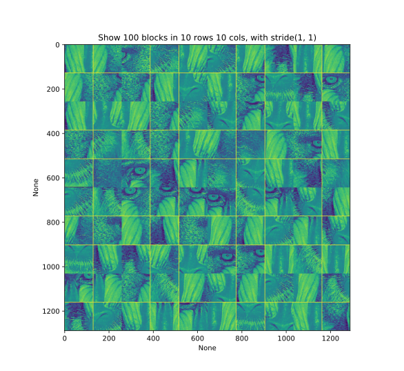

Tutorials
==================

Extract Pathches
-----------------------

What
~~~~~~~~~~~~~

Why
~~~~~~~~~~

How
~~~~~~~~

Examples
~~~~~~~~~~

run commands as follows:

::

   python examples/demo_GenTrainingSamples.py

and you can get

   This is an example for extract patches from images.

   This is an example for extract patches from images.

Classify Pathches
-----------------------

What
~~~~~~~~~~~~~

Why
~~~~~~~~~~

How
~~~~~~~~

Examples
~~~~~~~~~~

run commands as follows:

::

   python examples/demo_selpatches.py

and you can get

.. figure:: ./_static/figs/tutorials/classify_patches.png
   :scale: 50 %
   :alt: example for classifing patches
   :align: center

   This is an example for classifing patches.

   This is an example for classifing patches.

